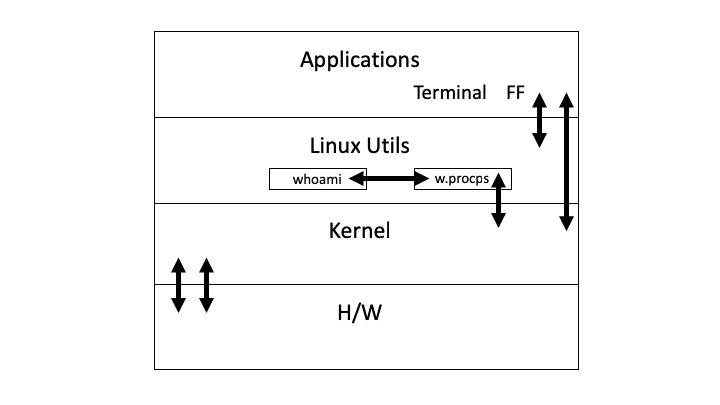

1) We will be mainly modifying the whoami utility. In essence, we will have whoami make calls to the 'w' utility which will in turn return information to the utility level      from the kernel in the form of user information explained below in questions 3 and 4.
2) Not applicable. We are not adding a new module.
3) 
4) We will be modifying the 'whoami' command. To do this we will use the 'w' command with the options 'whoami', '-h', and '-s'
   This will show the information in short form for the current user without the header shown from 'w'.

